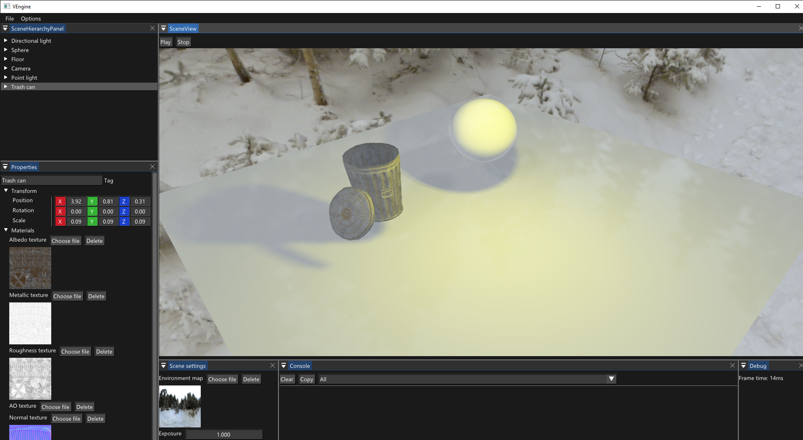
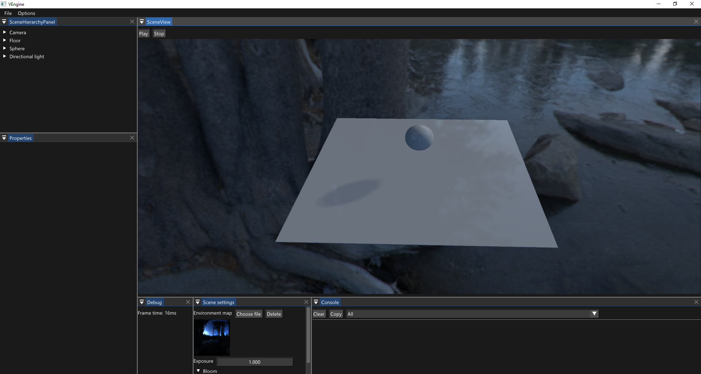
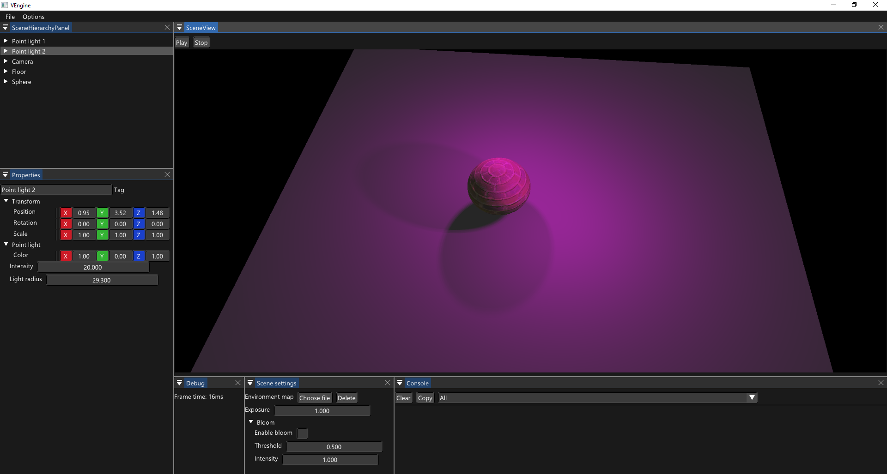

# VEngine
VEngine is OpenGL 3D game engine.
 

# Build
1. Clone project
2. Run GenerateProject.bat

# Features
* Deffered renderer
* Image based lightning
 
* Physically-based rendering
* HDR
* Directional and omnidirectional shadows
 

# Roadmap
- [ ] Bloom
- [ ] Temporal anti-aliasing
- [ ] Area lights
- [ ] Parallel split shadow maps
- [ ] Volumetric lightning
